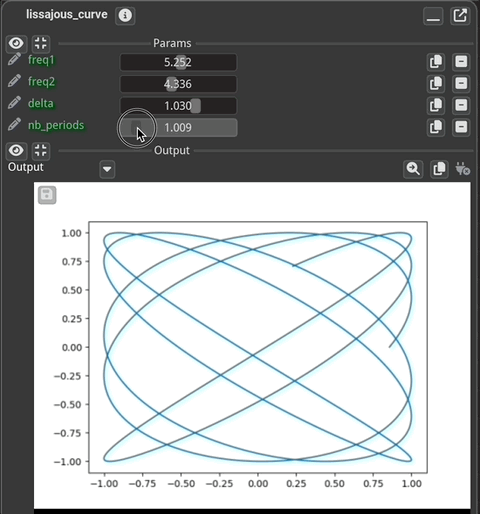
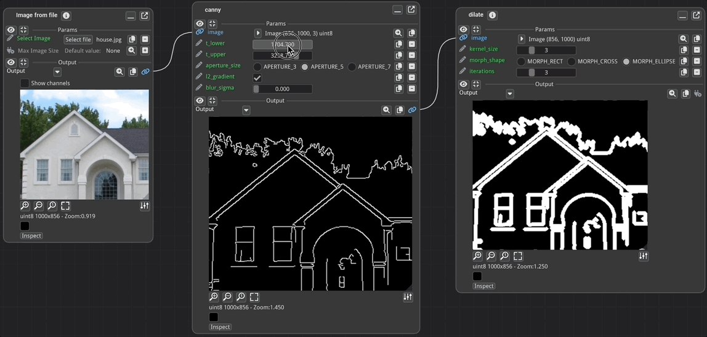

Fiatlight – Expressive Code, Instant Applications
=================================================

Automatically generate interactive UIs for structured data and functions.

Fiatlight reduces the gap between code and UI, letting you create fully functional applications in minutes.
Designed for researchers, engineers, and students, it automates GUI generation for functions, structured data,
and interactive workflows—without sacrificing flexibility.

> Fiatlight is not a no-code tool (nor a low-code tool), but  a clever-code tool.
> Use it to prototype, visualize, and fine-tune your work—without fighting a GUI framework.
>

Key Features
------------

* [x] Instant UI for Any Function – Wrap a function, get a GUI—no extra code.
* [x] Automatic UI for Structured Data – Works with Pydantic, dataclasses, and more.
* [x] Interactive Function Pipelines – Chain multiple functions into a visual workflow.
* [x] Built-in Validation & Debugging – Constraints, state persistence, and error replay.
* [x] Domain-Specific Kits – AI, image analysis, data visualization, and more.
* [x] High Performance – Runs on Dear ImGui, with GPU-accelerated rendering.


Quick Examples
--------------

### An interactive plot (Lissajous Curve)

```python
import numpy as np
import matplotlib; matplotlib.use("Agg")
import matplotlib.pyplot as plt

def lissajous_curve(
    freq1: float = 5.0, freq2: float = 4.0, delta: float = np.pi / 2, nb_periods: float = 1
) -> plt.Figure:
    """Creates a Lissajous curve, and returns a Matplotlib figure."""
    t = np.linspace(0, 2 * np.pi * nb_periods, 10_000)
    x = np.sin(freq1 * t + delta)
    y = np.sin(freq2 * t)
    fig, ax = plt.subplots()
    ax.plot(x, y)
    return fig


# Add a GUI to the code in a few seconds, using fiatlight
import fiatlight as fl

# Optional: set the range of the parameters
fl.add_fiat_attributes(lissajous_curve,
    freq1__range=(0, 10), freq2__range=(0, 10),
    delta__range=(-np.pi, np.pi), nb_periods__range=(0.1, 10))

# Run the function interactively
fl.run(lissajous_curve, app_name="Interactive Lissajou Curve")
```

**Result: A fully interactive UI where you can tweak parameters live:**




### Example 2: Fine tune an Image Processing Pipeline

```python
import fiatlight as fl
from fiatlight.fiat_kits.fiat_image import image_source, ImageU8, ImageU8_GRAY
from enum import Enum
import cv2

class CannyApertureSize(Enum):
    APERTURE_3 = 3
    APERTURE_5 = 5
    APERTURE_7 = 7

class MorphShape(Enum):
    MORPH_RECT = cv2.MORPH_RECT
    MORPH_CROSS = cv2.MORPH_CROSS
    MORPH_ELLIPSE = cv2.MORPH_ELLIPSE

@fl.with_fiat_attributes(
    blur_sigma__range=(0.0, 10.0),
    t_lower__range=(100.0, 10000.0), t_lower__slider_logarithmic=True,
    t_upper__range=(100.0, 10000.0), t_upper__slider_logarithmic=True,
)
def canny(image: ImageU8,
    t_lower: float = 1000.0, t_upper: float = 5000.0,
    aperture_size: CannyApertureSize = CannyApertureSize.APERTURE_5,
    l2_gradient: bool = True, blur_sigma: float = 0.0,
) -> ImageU8_GRAY:
    if blur_sigma is not None and blur_sigma > 0:
        image = cv2.GaussianBlur(image, (0, 0), sigmaX=blur_sigma, sigmaY=blur_sigma)  # type: ignore
    r = cv2.Canny(image, t_lower, t_upper, apertureSize=aperture_size.value, L2gradient=l2_gradient)
    return r

@fl.with_fiat_attributes(kernel_size__range=(1, 10), iterations__range=(1, 10))
def dilate(
    image: ImageU8_GRAY,
    kernel_size: int = 2,
    morph_shape: MorphShape = MorphShape.MORPH_ELLIPSE,
    iterations: int = 1,
) -> ImageU8_GRAY:
    kernel = cv2.getStructuringElement(morph_shape.value, (kernel_size, kernel_size))
    r = cv2.dilate(image, kernel, iterations=iterations)
    return r


# Fine tune an image processing pipeline in one line of code
fl.run([image_source, canny, dilate], app_name="demo_canny")
```

**Result: fine-tuning made easy!**



Installation
------------

⚠ Fiatlight is in active development – First release coming soon!

For now, install manually from source:

```
git clone https://github.com/pthom/fiatlight.git
cd fiatlight
pip install -r requirements.txt
pip install -e .
```

📖 Documentation & Tutorials
----------------------------

Coming soon.

Status & What’s Next?
---------------------

Fiatlight is new and rapidly evolving.
It is currently in a pre-release state, with the first public release coming soon.


Contribute & Stay Updated
-------------------------

Fiatlight is open-source and welcomes contributions.
Join us:

* Star the repo to follow updates!
* ️Help refine docs and examples.
* Discussions & feedback: Coming soon

License
-------

Fiatlight is licensed under the MIT License.
