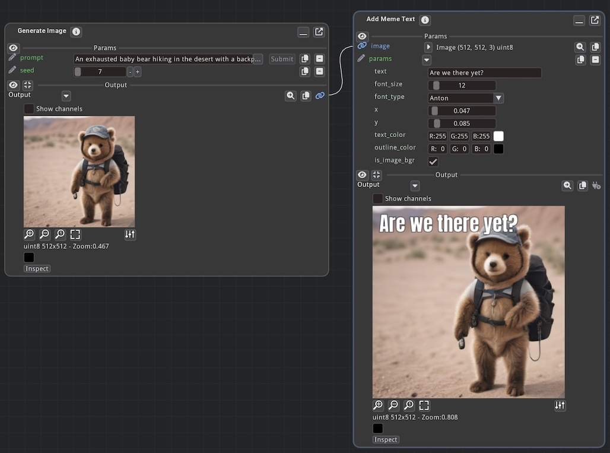
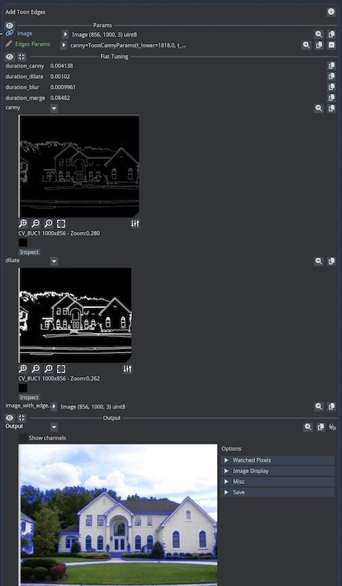

# Fiatlight

> *Turn Python functions into interactive apps in one line.*
>
> Visual pipelines, persistent state, zero UI code.

Fiatlight auto-generates rich user interfaces from your Python functions and structured data (dataclasses, pydantic models). Chain functions as visual node pipelines, tweak parameters in real time, and let Fiatlight handle state persistence — all without writing any UI code. Think of it as *ComfyUI, generalized to any Python function*.

## From Idea to App in Minutes

The application below combines two functions — `generate_image` (AI image generation) and `add_meme_text` (text overlay) — into a visual pipeline, with just 4 lines of code:

```python
import fiatlight as fl
from fiatlight.fiat_kits.fiat_ai import invoke_sdxl_turbo
from fiatlight.fiat_kits.fiat_image.add_meme_text import add_meme_text
fl.run([invoke_sdxl_turbo, add_meme_text], app_name="Old school meme generator")
```



## Key Features

- **Automatic GUI generation** — pass any typed Python function to `fl.run()` and get an interactive UI with appropriate widgets for each parameter
- **Visual function pipelines** — chain multiple functions as connected nodes with automatic data flow between them
- **Real-time feedback** — built on [Dear ImGui Bundle](https://pthom.github.io/imgui_bundle/), applications run at 120 FPS with immediate-mode rendering
- **State persistence** — all inputs, preferences, and window layouts are automatically saved and restored; users can save/load different application states
- **Visual debugging** — inspect intermediate internal variables of your functions, and replay exceptions with the exact same inputs
- **Domain-specific kits** — pre-built widgets for images (OpenCV), Matplotlib, ImPlot, Pandas DataFrames, and AI (Stable Diffusion)
- **Web deployment** — applications can run locally or be deployed as static web pages via Pyodide, with no server-side component

## Visualize and Debug Function Internals

Fiatlight lets you inspect the intermediate states of complex functions. Below, the `add_toon_edges` function's internal variables (edge detection, dilation) are displayed visually — even though they are not returned by the function:



## Quick Install

```bash
git clone https://github.com/pthom/fiatlight.git
cd fiatlight
pip install -r requirements.txt
pip install -v -e .
```

Optional dependencies are available for AI (`requirements-ai.txt`), audio (`requirements-audio.txt`), and development (`requirements-dev.txt`).

## Who Is It For?

Fiatlight is suited for hobbyists, educators, researchers, data scientists, and developers who want to rapidly create interactive applications, tune algorithms with visual feedback, or build shareable demos — without writing boilerplate UI code.

## Links

- **Documentation**: [pthom.github.io/fiatlight](https://pthom.github.io/fiatlight)
- **Dear ImGui Bundle**: [pthom.github.io/imgui_bundle](https://pthom.github.io/imgui_bundle/) (foundation of fiatlight user interfaces)
- **Discord**: [Join the community](https://discord.gg/xkzpKMeYN3)
