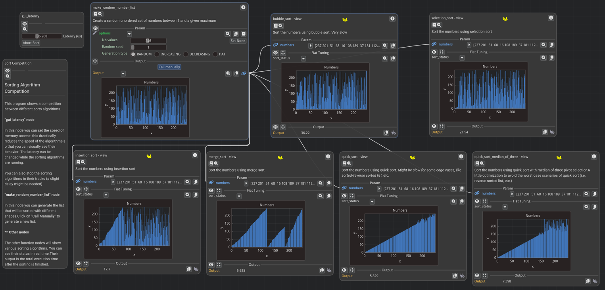

Tutorial An interactive visualization of different sorting algorithms, using Fiatlight
======================================================================================

This is a full tutorial that demonstrates many features of Fiatlight, going from basic to advanced.
Its viewing is recommended for anyone who wants to learn how to use Fiatlight.

Demo
----
In this tutorial, we will walk you through the process of creating this interactive application, which allows you to visualize and compare the performance of various sorting algorithms.

This tutorial is an intermediate to advanced tutorial which will teach you the following aspects of Fiatlight:
- How to create a GUI for a dataclass / pydantic model
- How to customize the rendering of a function output
- How to use ImPlot to plot large quantities of data at high frame rates
- How to run functions asynchronously
- How to use "fiat_tuning" to display in real-time a function's internal state
  (even if the function is running in a separate thread)
- How to use Fiatlight GUI in standalone applications

Intro - Ready-to-Use Sort Algorithms
------------------------------------

Before we dive into the content, let's quickly look at the sort algorithms and how the latency is handled.

The  code for this tutorial is located in "fiatlight/demos/tutorials/sort_competition".

* "sort_algorithms.py" " provides  ready to use sort algorithms:  bubble sort, quicksort, et cetera.
* "numbers_list.py" " provides a numbers list class which behaves like an integer array,   but exposes a user settable latency for memory access and memory write.
* "numbers_generator" provides a "NumbersGenerationOptions" class which describes how to generate a list of unordered numbers.
It derives from pydantic's BaseModel : it behaves like a serializable dataclass.
* "make_random_number_list" will generate the numbers that shall be sorted.

Part 1 - Automatic GUI for dataclasses and pydantic models
----------------------------------------------------------
+ Gui for a dataclass

The "gui_dataclass_pydantic" tutorial examples provide a detailed explanation on how to automatically create a GUI for a dataclass or a pydantic model.
Note that pydantic models are preferable since Fiatlight will be able to serialize and deserialize them, and thus save user inputs that use them.

These examples show how to use custom attributes to customize the widgets appearance (label, numeric range, etc.).
Let's see them in action.

It also shows how to use validators to ensure that the user inputs are correct. This is possible for dataclasses, and Pydantic validators are also gracefully handled.

- How to add a GUI for a pydantic model.
- How are pydantic validators handled?
- How to add fiat_attributes to set the ranges of value for numeric widgets.
- How to set the labels for functions and parameters
- Add info / attributes for a function
- How to create functions that are invoked on demand (i.e. when a button is clicked)

Part 2 - Customize the rendering of a function output
-----------------------------------------------------
+ Example / function

- How to create a custom renderer for a widget.
- How to specify widget sizes in DPI independent units.
- how to use ImPlot to plot large quantities of data at high frame rates

Part 3 - Use ImPlot to visualize the sorting algorithms
-------------------------------------------------------

Part 3:
-------
- What is the GUI registry? How to register a new type into Fiatlight
- How does AnyDataWithGui work? What are the available callbacks?
- Qick-look at the architecture of Fiatlight from 10,000 feet
- How to create a custom widget class ?
- Look at fiat_kit_skeleton

Part 4:
-------
- How to use "fiat_tuning" in order to display a function internal state
  is the GUI
  (In our case, we will be graphically displaying the current status of the ordering)
- How to run functions as synchronously
- How to disable the idling
- How to run a composition of functions

Part 5:
-------
- How to run a custom function graph.
- How to add a "GUI Only" node to the graph (i.e. a node that does not have a corresponding function)
- how to add "Documentation" node to the graph

Part 6:
------
- How to create a standalone app version of the sort visualization
  (that will reuse the GUI provided by Fiatlight)
- How to create the layout of an application:
  - Using standard ImGui layout functions (begin_group, same_line, etc)
  - Using Dockable windows

======================================================================================

Quick-look at the architecture of Fiatlight from 10,000 feet
============================================================

First, let's take a quick look at the class diagram architecture for Fiatlight
------------------------------------------------------------------------------

- **AnyDataWithGui**: This class can wrap any data type into a GUI, providing a lot of customizable callbacks.

- **FunctionWithGui**: This class wraps a function into a GUI. It contains several instances of AnyDataWithGui, one for each input and output of the function.

- **FunctionGraph**: This represents a graph of functions. It contains multiple instances of FunctionWithGui, one for each function in the graph, with the corresponding connections between them.

- **fiat_togui module**: This module provides functions to register data types, associating them with a GUI. It contains a singleton where all the registered types are stored. The "register_type" function is the main entry point to associate a new data type with its GUI.

Primitive types - str, int, float, etc. - and enums are already registered by default. If a type is registered, its optional variant (optional[Type]) is also registered by default. As we saw before, dataclasses, Pydantic BaseModel, and tuple types are also handled nicely, provided their members are registered.

Let's now take a look at AnyDataWithGui and its callbacks
----------------------------------------------------------

- **AnyDataWithGui**: Handles a value, which is an instance of a given DataType. However, it can also handle instances of Unspecified (if the user did not enter any value), Invalid[DataType] (if validation failed), or Error.

- **AnyDataGuiCallbacks**: Provides numerous customizable callbacks. The most important ones are:
  - **present**: Presents a value with a nice GUI.
  - **edit**: Edits a value with a nice GUI, returning a bool indicating if the value was changed, along with the new value.

Let's now look at the fiat_kits module and the kit skeleton
------------------------------------------------------------

fiat_kits provides several submodules adapted to different domains. For example, fiat_dataframe provides a GUI for pandas DataFrame, and fiat_implot provides a GUI for Matplotlib figures, etc.

**fiat_kit_skeleton** is a template to helps in the creation of new kits. In this skeleton, MyData is a simple example of a custom data type to be registered into Fiatlight. MyDataWithGui is A descendant of AnyDataWithGui that provides the GUI for MyData. It can implement several callbacks; and MyDataPresenter is an example of best practices for separating GUI handling from the implementation of AnyDataWithGui.
 As mentioned before, MyData is registered into Fiatlight by calling fiat_togui.register_type(MyData, MyDataWithGui).

